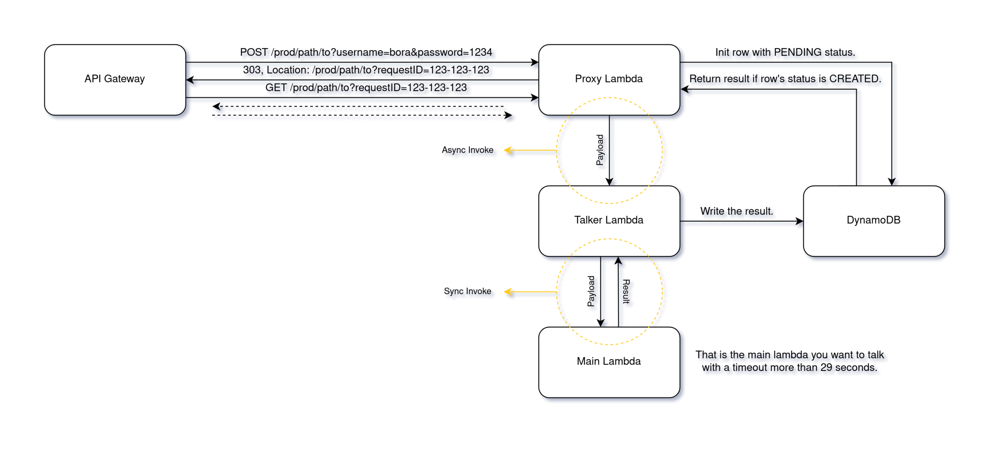

# ZEO.ORG - Timeout Increaser

This project simply increases AWS API Gateway's timeout limit.

## Why

As you know, AWS API Gateway has a hard limit for timeout; 29 seconds. In today's world, it is normal to expect a service to return in less than 29 seconds. But unfortunately, in the real world, not every situations fit this. There may be situations where we need to keep the client waiting for a long time. That's why we made this structure.

## How

It works simply as follows; when there is an incoming request, the Proxy gives a RequestID to this request and adds a row to DynamoDB as a PENDING status. Then invokes Talker as async.

After that, it checks the status in DynamoDB every 2 seconds, the duration is 22-24 seconds at max. If the status becomes CREATED during this process, the result returns to the user after deleting the related row from the database. If the status doesn't become CREATED in the process, which is exactly the situation we want to overcome, returns a 303 response with RequestID to get user one more time.

When the client arrives with a RequestID, the DB is checked again, this process continues until the Status becomes CREATED.

## Structure

**Proxy:** Handles requests from the API Gateway, invokes the Talker as async, returns result by checking DynamoDB.  
**Talker:** Invokes the Main as sync, write the result to DynamoDB.  
**Main:** That's the real project that we want to overcome timeout limit for it.



## How to use it?

That's a plug-in-play project.  
You can use is without changing the code. At least, that's the our aim.  
If the code base doesn't fit your situation, you can create an issue. 

- Create a DynamoDB table with RequestID(string) primary key.
- Create Proxy function  
    - The maximum allowed timeout is 900 seconds. But remember, this function talks with API Gateway, 29 seconds is a hard limit. You may set ~35 seconds.
    - Stage name is the name you use in API Gateway for staging. 
	  ```shell
	  cd /path/to/proxy
	  go build -o proxy && zip deploy.zip proxy
	  ```
	  ```shell
	  aws lambda create-function --function-name <func-name> \
	      --handler proxy --runtime go1.x \
	      --role  arn:aws:iam::<account-id>:role/<role> \
	      --zip-file fileb://./deploy.zip \
	      --tracing-config Mode=Active \
	      --timeout <timeout-in-seconds> \
	      --environment: '{"Variables":{"DYNAMODB_TABLE_NAME":"<table-name>","LAMBDA_TALKER_NAME":"<talker-name>","STAGE_NAME":"<api-stage-name>"}}'
	  ``` 
- Create Talker function  
    - The maximum allowed timeout is 900 seconds. This limit is imported for the timeout that we need. You can set whatever you need. In our case, 180 seconds were enough for us.
	  ```shell
	  cd /path/to/talker
	  go build -o talker && zip deploy.zip talker
	  ```
	  ```shell
	  aws lambda create-function --function-name <func-name> \
	      --handler talker --runtime go1.x \
	      --role  arn:aws:iam::<account-id>:role/<role> \
	      --zip-file fileb://./deploy.zip \
	      --tracing-config Mode=Active \
	      --timeout <timeout-in-seconds> \
	      --environment: '{"Variables":{"DYNAMODB_TABLE_NAME":"<table-name>","MAIN_LAMBDA_NAME":"<main-name>"}}'
	  ```   
- Create your Main function. Don't forget to set a timeout for it too. You can set it same with Talker's timeout.
- Create AWS API Gateway for Proxy function. Make your personal settings. Add your method(s) to the API. Also, You have to add a GET method that accept `requestID` as required param to your API Gateway, otherwise 303 will not work.

After complete all steps, you can use your API as usual, but with a looong timeout.


## There is a better way!

If you think structure could be better, please open Issue or PR to share your opinion. We are open to get support!

## Known Issues

If the API has an api-key protection, returning 303 will be broken. We consider to implement a way for it.

## Credits

| [](https://github.com/boratanrikulu) <br/>[Bora Tanrıkulu](https://github.com/boratanrikulu)<br/><sub>Developed By</sub><br/> |  
| - |
